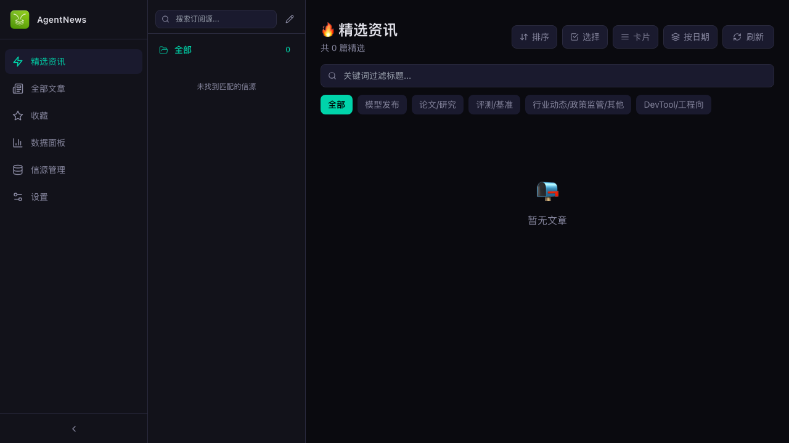

<div align="center">

**[English](README_EN.md) | 简体中文**


# AgentNews

**AI 智能资讯精选与降噪系统**

多渠道聚合 → LLM 深度解析 → 四步规则引擎精选 → 桌面端 + 飞书多端分发

[](LICENSE)
[](https://python.org)
[](https://nextjs.org)
[](https://electronjs.org)
[](https://conventionalcommits.org)



</div>

---

## ✨ 简介

AgentNews 面向 AI 从业者及技术爱好者，解决"信息过载"痛点：

- **自动化抓取** — 定时从自定义信源（RSS / 网页）抓取最新文章
- **LLM 智能分析** — 调用 OpenAI / Anthropic 等模型对每篇文章进行分类、评分、摘要
- **四步硬核精选** — 规则引擎实现分类拦截 → 相关性过滤 → 模型精选 → 重要性门槛四级漏斗
- **多主题前端** — Next.js 暗色/亮色/跟随系统 UI，支持分类筛选、按信源分组、收藏、搜索
- **飞书推送** — 入选文章自动推送到飞书 Webhook 群
- **Electron 桌面应用** — 一键打包 macOS / Windows / Linux，开箱即用

---

## 🏗️ 架构总览

```
┌──────────────┐      ┌──────────────┐      ┌──────────────┐
│  RSS / Web   │─────▶│   Ingestion  │─────▶│   Dedup      │
│  Sources     │      │  (Fetcher)   │      │ (URL Hash)   │
└──────────────┘      └──────────────┘      └──────┬───────┘
                                                    │
                                                    ▼
┌──────────────┐      ┌──────────────┐      ┌──────────────┐
│   Feishu     │◀─────│  Rules       │◀─────│   LLM        │
│   Webhook    │      │  Engine      │      │  Extractor   │
└──────────────┘      └──────┬───────┘      └──────────────┘
                             │
                             ▼
                    ┌──────────────┐      ┌──────────────┐
                    │   SQLite     │◀────▶│   Next.js    │
                    │   Storage    │      │   Frontend   │
                    └──────────────┘      └──────────────┘
```

**流水线五步流程**: 信源获取 → 数据采集 & 去重 → LLM 深度分析 → 规则引擎精选 → 飞书推送

---

## 🛠️ 技术栈

| 层级 | 技术 |
|------|------|
| 后端框架 | Python ≥ 3.10 · FastAPI · Uvicorn |
| 数据库 | SQLite + aiosqlite（单文件，免运维） |
| 数据采集 | feedparser · httpx · BeautifulSoup · markdownify |
| LLM | OpenAI 兼容 API（GPT-4o-mini / DeepSeek / Claude 等） |
| 前端框架 | Next.js 13.5 · React 18 · TypeScript 5.3 · Tailwind CSS 3.4 |
| 桌面应用 | Electron 33 · electron-builder 25 |
| 推送 | 飞书 Webhook（交互式卡片消息） |
| 测试 | Vitest（前端 223 测试） · Pytest（后端 283 测试） |
| 工程化 | Husky · commitlint · Conventional Commits · SemVer |

---

## 🚀 快速开始

```bash
# 克隆并安装
git clone https://github.com/strawberry-fdf/SearchNewsAgent.git
cd SearchNewsAgent
pnpm install

# Python 环境
python -m venv venv && source venv/bin/activate
pip install -r backend/requirements.txt

# 配置 LLM（也可在前端设置页面配置）
cp build/default.env .env
# 编辑 .env，填入 OPENAI_API_KEY 等

# 一键启动
pnpm dev
```

启动后访问 http://localhost:3000 ，后端 API 运行在 http://localhost:8000 。

> 更多开发环境细节见 [CONTRIBUTING.md](CONTRIBUTING.md#开发环境搭建)

---

## 📁 项目结构

```
SearchNewsAgent/
├── backend/                     # Python FastAPI 后端
│   ├── api/routes.py            #   REST API 路由（30+ 端点）
│   ├── ingestion/               #   数据采集（RSS + 爬虫 + 去重）
│   ├── llm/                     #   LLM 分析引擎（多模型支持）
│   ├── rules/engine.py          #   四步精选规则引擎
│   ├── notification/feishu.py   #   飞书 Webhook 推送
│   ├── storage/db.py            #   SQLite 异步存储（8 张表）
│   ├── pipeline.py              #   五步 Pipeline 编排器
│   └── tests/                   #   后端测试（283 tests）
├── frontend/src/                # Next.js 前端
│   ├── components/              #   React 组件（10 个）
│   ├── lib/api.ts               #   API 客户端封装
│   └── __tests__/               #   前端测试（223 tests）
├── electron/                    # Electron 桌面主进程
├── scripts/                     # Node.js 工程化脚本
│   ├── dev.mjs                  #   开发环境启动器
│   ├── commit.mjs               #   交互式规范提交
│   ├── release.mjs              #   语义化版本发布
│   ├── check.mjs                #   代码质量检查
│   └── build.mjs                #   统一构建流水线
├── docs/                        # 详细文档
├── .husky/                      # Git Hooks（pre-commit + commit-msg）
├── CONTRIBUTING.md              # 贡献指南
└── package.json                 # 全部脚本命令
```

---

## 📋 脚本命令

```bash
pnpm dev              # 启动开发环境（后端 + 前端 + Electron）
pnpm check            # 全部质量检查（tsc + Vitest + Pytest）
pnpm commit           # 交互式规范提交
pnpm release:patch    # 发布补丁版本 (x.x.1)
pnpm release:minor    # 发布次版本 (x.1.0)
pnpm release:major    # 发布主版本 (1.0.0)
pnpm build:mac        # 构建 macOS 桌面应用
pnpm build:win        # 构建 Windows 桌面应用
pnpm build:linux      # 构建 Linux 桌面应用
```

> 完整命令列表见 `package.json` 中的 scripts 字段

---

## 🔍 核心精选规则

每篇文章经 LLM 分析后，进入四步规则引擎逐级筛选：

| 步骤 | 规则 | 淘汰标记 |
|------|------|----------|
| 1 | 分类拦截 — `category == "非AI/通用工具"` | `REJECTED_NON_AI` |
| 2 | 相关性 — `ai_relevance < 60` | `REJECTED_LOW_RELEVANCE` |
| 3 | 模型推荐 — `model_selected == false` | `REJECTED_MODEL_UNSELECTED` |
| 4 | 重要性门槛 — 按分类动态阈值 | `REJECTED_LOW_IMPORTANCE` |


---

## 🔌 API 概览

后端提供 30+ REST 端点，完整列表见 [系统架构文档](docs/system-architecture.md#4-api-端点)。核心端点：

| 方法 | 路径 | 说明 |
|------|------|------|
| GET | `/api/articles/selected` | 获取精选文章列表 |
| GET | `/api/articles` | 获取全部文章（支持筛选） |
| POST | `/api/articles/{url_hash}/star` | 切换收藏状态 |
| GET | `/api/sources` | 获取信源列表 |
| POST | `/api/sources` | 添加新信源 |
| POST | `/api/admin/run-pipeline` | 手动触发 Pipeline |
| GET | `/api/admin/pipeline-stream` | SSE 实时日志流 |
| GET | `/api/stats` | 统计数据 |

---

## 💻 桌面应用

Electron 打包为跨平台桌面应用，无需配置 Python / Node 环境：

| 平台 | 格式 |
|------|------|
| macOS | `.dmg`（arm64） |
| Windows | `-setup.exe` (NSIS)（x64） |
| Linux | `.AppImage`（x64） |

产物输出至 `dist/` 目录。详细打包说明见 [Electron 打包指南](docs/electron-packaging.md)。

---

## 🤝 贡献指南

欢迎参与！请阅读 [CONTRIBUTING.md](CONTRIBUTING.md) 了解开发环境搭建、提交规范、测试要求与 PR 流程。

---

## 📄 License

[MIT](LICENSE)
